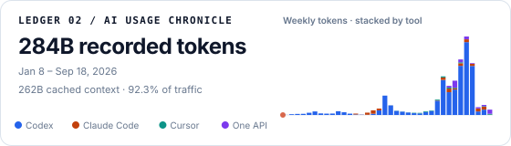

# AI Usage Chronicle

<a href="https://brickerp.github.io/ai-usage-report/">
  <picture>
    <source media="(prefers-color-scheme: dark)" srcset="./public/ai-usage-card-dark.svg">
    
  </picture>
</a>

A personal, all-time token timeline for **Codex / Claude Code / Cursor / One API**, backed by the existing multi-Mac collector. The headline, cache disclosure, Skyline, and README cards are derived from `public/usage.json` on every build.

Live site: https://brickerp.github.io/ai-usage-report/

Supports **multiple Macs**: each machine writes `public/machines/<id>.json`; publish merges them (SUM for local tools; Cursor from account API).

## Quick start (one Mac)

```bash
git clone https://github.com/BrickerP/ai-usage-report.git
cd ai-usage-report
npm install

# Dev UI against public/usage.json
npm run dev

# Refresh data from this machine (needs Codex rollout logs + Cursor session + One API state)
export AI_USAGE_MACHINE_ID=mac-home          # unique per Mac
export AI_USAGE_TIMEZONE=Asia/Shanghai
npm run collect

# Build the static site and both README SVG cards into docs/
npm run build
npm run preview
```

## GitHub Profile card

The build emits fixed light and dark SVG files instead of running a dynamic card service. A GitHub Profile README can link the card to the full Chronicle:

```html
<a href="https://brickerp.github.io/ai-usage-report/">
  <picture>
    <source media="(prefers-color-scheme: dark)" srcset="https://brickerp.github.io/ai-usage-report/ai-usage-card-dark.svg">
    
  </picture>
</a>
```

The cards intentionally show only the dynamically computed recorded-token total, date span, cache disclosure, and a weekly stacked Skyline. Spend, models, machines, rankings, and runtime theme endpoints stay on the full page or out of the public card.

## Two Macs (recommended)

On **each** Mac, set a different machine id (launchd / shell profile):

```bash
export AI_USAGE_MACHINE_ID=mac-home     # other Mac: mac-office
export AI_USAGE_TIMEZONE=Asia/Shanghai
```

Then either:

```bash
bash scripts/publish.sh
# or
npm run publish:pages
```

What happens:

1. Collect this Mac into the durable ledger `public/machines/<your-id>.json`
   - **First run** on a machine: seed full local history once
   - **Later runs**: re-read `mutable_from` through today, then keep yesterday + today open
   - If the Mac was off for days, the old boundary remains and every missed day is recovered
   - A lower source snapshot is never allowed to overwrite the stored high-water value
2. `git pull --rebase` — pick up the other Mac’s fragment and latest account snapshots
3. After the pull, fetch and atomically cache a complete five-calendar-day One API
   account snapshot. Keep the Codex model family and Claude model family in their
   own series (Codex appends onto the local Codex series; Claude rebuilds the
   Claude Code series), and retain only residual non-GPT/Codex and non-Claude
   models in the One API series; preserve the complete prior model timeline
   outside that window
4. Fetch Cursor Dashboard API (account-level; it has its own `cursor_mutable_from` boundary)
5. SUM local tools across all fragments and reconcile each account-level source by
   its latest complete snapshot → write `public/usage.json`
6. Build + commit + push
7. If push races the other Mac: pull → **re-merge** → rebuild → push again

`usage.json.source_status` records refresh health separately from the aggregate
`generated_at`. A failed account-level refresh keeps the last known good values,
but the page shows the affected source as stale or failed instead of implying that
every source was refreshed successfully.

Same launchd schedule on both Macs is fine; a push collision just triggers re-merge.

### Merge rules

| Tool | Rule |
|------|------|
| Codex | Per-machine durable fragment; dates before `mutable_from` are frozen, the open window is re-collected from `~/.codex` rollout JSONL; report = SUM across `machines/*.json` **plus the One API gateway's Codex model family** (additive append, no dedup) |
| Claude Code | Account-level; rebuilt from the One API gateway's Claude model family for the last two calendar days, older local collector values stay frozen; do not SUM across Macs |
| Cursor | Account-level; dates before `cursor_mutable_from` are frozen, the open window is refreshed; do not SUM across Macs |
| One API | Account-level residual gateway series; collect after pull, keep the GPT/Codex model family in a dedicated `codex` series and the Claude family in the `claude` series, replace only a complete five-day fetch window, and keep prior history on missing/expired state or incomplete pagination. Local Comate history is retained here only for dates without gateway coverage |

The non-overlap rule assumes Cursor reports its own cloud usage and
`use_openai_key=false`. This is the currently verified account configuration.
If Cursor is later pointed at a custom OpenAI-compatible gateway, revalidate the
boundary before combining Cursor and One API totals.

One-time migration: `public/machines/legacy-other-mac.json` holds pre-multi-mac Codex/Claude history from the old single-Mac `usage.json`. After the other Mac publishes its own `machines/<id>.json`, delete the legacy file and re-publish once.

`--force-reseed` rebuilds a machine fragment from scratch (breaks freeze — only use if you intentionally want to replace that Mac’s ledger).

## Flags

`publish.sh`:

- `--skip-collect` — rebuild UI only
- `--skip-push` — local build only
- `--backfill-codex-cache` — one-time migration for this Mac's frozen Codex cache-read breakdown

Collector (`npm run collect` / Python):

- `--machine-id` / `AI_USAGE_MACHINE_ID`
- `--machines-dir` (default `public/machines`)
- `--no-merge` — write this Mac’s fragment only
- `--merge-only` — re-merge existing fragments + Cursor API (used after push conflict)
- `--collect-local-only` — atomically capture this Mac before any GitHub/build work
- `--today` — print today’s table
- `--backfill-codex-cache` — derive frozen cache read as `total - input - output`
- `--dry-run` — validate that migration without writing files

### One-time Codex cache backfill

Older fragments stored Codex totals correctly but wrote `codex_cache_read=0` because
the collector used the legacy `cachedInputTokens` field instead of ccusage's current
`cacheReadTokens`. The migration reconstructs the cache value from the same frozen
snapshot (`codex_tokens - codex_input - codex_output`). It changes no totals, costs,
dates, or Claude/Cursor fields and does not read mutable historical session logs.

Run it once on each Mac with that Mac's existing unique machine id. Publish Macs
strictly one at a time: do not start Mac B until Mac A reports a successful push.
The publish command also has a generated-file-only reconciliation path if two Macs
race accidentally; it preserves each machine fragment and rebuilds the shared aggregate.

```bash
export AI_USAGE_MACHINE_ID=mac-home
export AI_USAGE_TIMEZONE=Asia/Shanghai

# Validate first; does not write or publish.
python3 scripts/usage_pipeline.py \
  --json-out public/usage.json \
  --machines-dir public/machines \
  --machine-id "$AI_USAGE_MACHINE_ID" \
  --backfill-codex-cache \
  --dry-run

# Pull, migrate this machine fragment, rebuild, commit, and push.
bash scripts/publish.sh --backfill-codex-cache
```

The migration fails closed on missing components, duplicate dates, negative derived
cache, or an existing nonzero cache value that conflicts with the frozen snapshot.
Do not use `--force-reseed` for this migration.

## Layout

| Path | Role |
|------|------|
| `src/` | Astryx + React report UI |
| `public/usage.json` | Merged daily series for the UI |
| `public/ai-usage-card-{light,dark}.svg` | Generated static GitHub README cards |
| `public/machines/<id>.json` | Per-Mac Codex fragment plus one-time local Comate history |
| `scripts/generate_readme_cards.mjs` | Dynamic summary + weekly Skyline SVG generator |
| `scripts/usage_pipeline.py` | Collect + merge |
| `scripts/ai_usage_comparison_image.py` | Compatibility CLI for the former collector name |
| `scripts/model_prices.v1.json` | Versioned Codex estimate ledger |
| `scripts/cursor_usage_api.py` | Cursor session, API, redaction, and event normalization library |
| `scripts/cursor_usage_api_probe.py` | Manual Cursor diagnostic export CLI |
| `scripts/oneapi_usage.py` | One API browser collection, model ownership filter, and aggregation |
| `scripts/comate_usage.py` | Local Comate session parser |
| `scripts/machine_fragments.py` | Fragment I/O + SUM merge |
| `scripts/legacy_report_renderer.py` | Legacy `--out` / `--png` report rendering |
| `scripts/publish.sh` | Pull → collect → build → push (+ re-merge on conflict) |
| `docs/` | Built GitHub Pages output |

## Data sources

- Codex: `~/.codex` rollout JSONL (sum of each request's real token increment)
- Claude Code: One API gateway's Claude model family (last two calendar days; older dates keep prior local collector values)
- Cursor: authenticated Dashboard API via local Cursor session
- Historical Comate: `~/.comate-engine/store/chat_session_*` (positive
  `contextUsed` deltas; cost always 0), migrated under One API only on dates
  without gateway coverage
- One API: management log API through a saved `chrome-use` UUAP session. The GPT/Codex
  model families are split out into a dedicated `codex` series (appended onto the
  local Codex tool series); the Claude model family is split out into the
  Claude Code tool; other named models such as Grok,
  DeepSeek, GLM, Kimi, and MiniMax form the residual series. Empty model names are
  excluded as unclassified. Ownership matching recognizes provider prefixes
  separated by `/`, `.`, `:`, `,`, or `\\`, so names such as
  `anthropic.claude-*`, `openai.gpt-*`, and `provider.o3` are classified
  deterministically. Each snapshot records its account scope, timezone-aware
  capture time, ownership-rule version, complete calendar window, and a stable
  SHA-256 content id; model rows retain canonical and raw labels.
- Costs: the checked-in, versioned model-price ledger for reproducible
  Codex estimates; unresolved historical models retain any collector
  estimate, or remain unpriced, with explicit `legacy`/`unpriced` provenance
  rather than being presented as part of the pinned ledger.
  Cursor uses its account API; One API quota (including the Claude Code series
  and the gateway-routed Codex series)
  is converted at 250,000 units/CNY and estimated at the pinned 0.14 USD/CNY rate.

Save or refresh the One API browser state after logging in manually:

```bash
chrome-use open https://oneapi-comate.baidu-int.com/log
install -d -m 700 "$HOME/Library/Application Support/ai-usage-report"
chrome-use state save "$HOME/Library/Application Support/ai-usage-report/oneapi-chrome-state.json"
chmod 600 "$HOME/Library/Application Support/ai-usage-report/oneapi-chrome-state.json"
```

The default state location is persistent across reboots. Use
`ONEAPI_STATE_PATH` to choose another state file. Collection is complete-or-
nothing: rate-limit or authentication failures retain the prior published One
API series instead of writing a partial or zero snapshot. The publisher collects
this account snapshot after `git pull` and installs its cache with an atomic
rename, preventing an older pre-pull or half-written cache from replacing newer
remote data. Set `CHROME_USE_BIN`
when the executable is outside the LaunchAgent `PATH`; otherwise the collector
also checks `~/.local/bin/chrome-use`.

Each published daily row also carries compact model breakdowns. The Explore
section aggregates those rows for the selected date range; selecting a tool
reveals its model series, and focusing a model updates the chart, URL, keyboard
state, and accessible status together. No separate model dashboard is
introduced.

## launchd

Point your LaunchAgent at the bounded retry wrapper, not directly at
`publish.sh`:

```bash
export AI_USAGE_MACHINE_ID=mac-home
export AI_USAGE_TIMEZONE=Asia/Shanghai
bash /path/to/ai-usage-report/scripts/launchd-run.sh
```

Recommended LaunchAgent settings:

- `RunAtLoad = true` for login/reboot catch-up.
- `KeepAlive` absent/false; this is a finite batch job.
- Two `StartCalendarInterval` entries: shortly after midnight to close yesterday,
  and one daytime snapshot (for example `00:05` and `15:03`). Stagger the
  second Mac by several minutes to reduce avoidable push races.

`publish.sh` captures the machine-local fragment **before** Git fetch/pull, then
pulls, collects the complete One API account window, refreshes Cursor, merges,
builds, and pushes. If GitHub or the build is down, `launchd-run.sh` retries the
complete pipeline without losing the local
snapshot. Every run refreshes at least today + yesterday, while an older persisted
boundary expands the recovery window across any missed days. Local source logs
must still be retained until at least one later successful reconciliation; no
collector can reconstruct records that were deleted before they were ever read.

Run the LaunchAgent from a dedicated publisher clone. The publisher refuses to
switch branches or abort an in-progress Git operation. After the local snapshot
is durable but before pull/build/commit, it non-interactively reads the configured
Git credential for `origin` and verifies repository write access with a
no-mutation dry run to a unique probe ref. It does not infer authentication
identity from the credential username. The real push uses the ordinary Git
credential helper; the publisher does not invoke `gh` directly or print the
stored password.
Only generated report artifacts are staged. Source-code releases should be
committed separately from scheduled data refreshes.

Required env:

- `AI_USAGE_MACHINE_ID` (required; use one stable, unique value per Mac)

Optional env:

- `AI_USAGE_TIMEZONE` (default `Asia/Shanghai`)
- `GH_PUBLISH_ACCOUNT` (default `BrickerP`; commit author/config label only, not authentication identity)
- `PUBLISH_BRANCH` (default `main`)
- `ONEAPI_STATE_PATH` (default
  `~/Library/Application Support/ai-usage-report/oneapi-chrome-state.json`)
- `CHROME_USE_BIN` (optional explicit path to the `chrome-use` executable)
- `AI_USAGE_RETRY_ATTEMPTS` / `AI_USAGE_RETRY_DELAY_SECONDS`
- `AI_USAGE_JOB_RETRY_ATTEMPTS` / `AI_USAGE_JOB_RETRY_DELAY_SECONDS`
